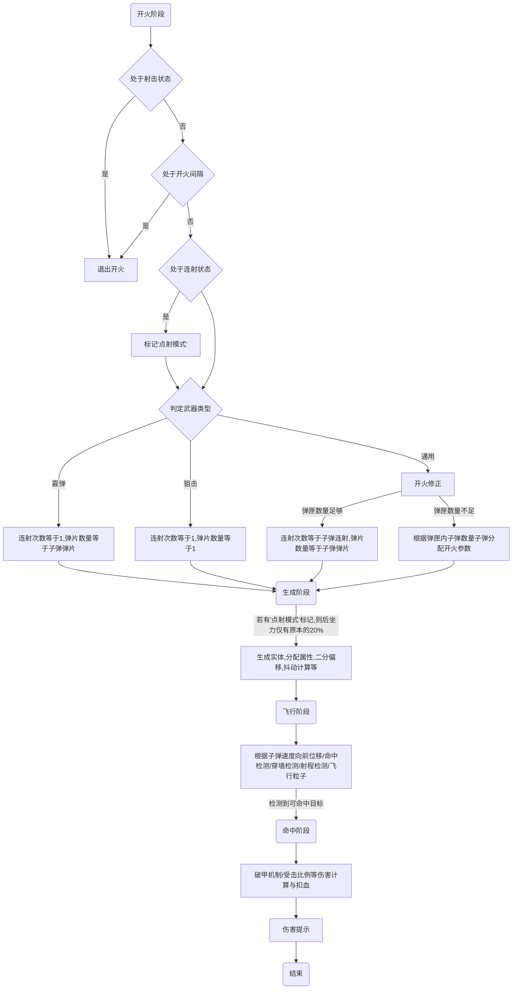

# 无邪枪系统
## 定价方面
最新完整版 - 260r
> 包含以下内容:
> * 功能介绍出现的全部功能
> * 后续更新添加的更多功能
> * 免费的人工到服适配服务
> * 永久售后与长期更新优化
> * 该系统全部历史版本文件
> * 专属售后群供使用者讨论

**唯一 唯一 唯一** 购买方式:Q445714414

---
## 机制介绍

### 子弹射击
 - 未装备武器时，快捷物品栏最后一格将替换为屏障
 - 在装备武器时，快捷物品栏最后一格将替换为鱼竿
 - 使用鱼竿抛竿将触发开火指令
 ```
 - 检测是否处于连射状态，是则取消开火指令
 - 检测是否处于武器开火间隔，是则取消开火指令
```
 - 判断玩家攻击方式是 *[连射] 还是 *[点射]
 ```
 连射：按住鱼竿连续触发抛竿动作
 点射：两次抛竿之间间隔一定时间
 点射的后坐力仅有连射状态的20%
 每次连续开火的第一次射击必是点射
 ```
 - 根据当前使用武器类型计算开火所需弹药
 - 弹匣内子弹不足以射出子弹时播放干扣音效并取消开火指令
 - 弹匣内子弹不足以进行一次 *[完美射击] 时将进行一次 *[开火修正]
 ```
 完美射击:弹匣内子弹数≥子弹连射*子弹弹片
 开火修正:消耗完弹匣内部分剩余子弹进行射击
 连射次数=剩余子弹/子弹弹片
 ```
 - 根据弹片数量生成对应数量的子弹实体并赋予其属性
 - 同步子弹的朝向与玩家角度相同并进行 *[垂直修正]
 ```
 垂直修正：当玩家|垂直朝向角度|＞45时，facing并不能完美的同步子弹实体与玩家的垂直朝向角度，因此得做一些特别处理来同步二者
 ```
 - 根据后坐力属性计算抖动系数并播放不同程度的屏幕抖动动画
 - 根据子弹属性进行后坐力偏转
 ```
 偏转是完全根据子弹的后坐力属性进行随机角度偏移
 水平偏移角度的最大值=子弹后坐力x
 垂直偏移角度的最大值=子弹后坐力y
 因此子弹弹道是在后坐力范围内完全随机的
 ```
 - 子弹飞行并寻找合法可命中目标
 ```
 子弹射程：最远可飞行距离
 子弹速度：每游戏刻位移格数
 穿墙检测：子弹触墙子弹销毁
 合法可命中目标：血量属性已数据化，且非自动射出者
 ```
 - 子弹命中结算伤害
 ```
 受击比例计算:子弹伤害*=受击比例，此值默认1.00
 破甲机制计算：若破甲，造成伤害=子弹伤害；若未破甲，造成伤害=子弹伤害*0.2
 ```
 - 子弹命中伤害显示
 ```
 若子弹伤害来源为玩家，则会记录短时间内自身受到的伤害总和反馈给射击者
 ```


### 弹匣系统
 - 未装备武器时，快捷物品栏倒数第二一格将替换为屏障
 - 在装备武器时，快捷物品栏倒数第二一格将替换为弹匣
 ```
 弹匣的表示方块将根据弹匣含量变化
 弹匣含量：弹匣内剩余子弹数量/弹匣最大可填装子弹数
 0   ~ 20%  黑色玻璃
 21% ~ 40%  红色玻璃
 41% ~ 60%  紫色玻璃
 61% ~ 80%  蓝色玻璃
 81% ~ 100% 绿色玻璃
 ```
- 手持弹匣时将显示弹匣内子弹的具体状态
- 手持弹匣保持低头时短暂时间后触发换弹指令
```
此操作有个短暂读条
读条过程中稍微抬头即可取消读条
读条结束前进行弹匣已满检测，若弹匣已满则取消读条
读条结束前进行弹药背包检查，若背包内无对应类型弹药取消读条
读条结束时触发换弹指令
读条触发有内置CD
```
- 进行弹匣换弹
```
根据武器换弹时长的属性进行读条
状态栏将实时显示换弹进度百分比
读条过程中抬头可以取消换弹指令
若背包内子弹数量不足以填满弹匣，会把背包内对应类型子弹全部填装至弹匣
若武器使用的子弹类型为0时，填装弹匣不消耗子弹(无限弹药，供测试使用)
```
- 弹匣退弹处理
```
当弹匣属性发生变动时(包括但不限于拆卸武器/拆卸弹匣)
会根据弹匣内剩余子弹数量返还相应类型子弹至子弹背包

若弹匣内剩余子弹数量>弹匣所能填装最多子弹数时
多余的子弹将根据子弹类型返还至子弹背包
```

### 装备系统
- 简单无脑的装备制作方法（0基础也能学会）
```
售后群会有视频教程
操作简单无需指令基础仅需复制模板就行
直接填装备属性不用思考就可以添加制作新装备
二分法免举:无需自己额外做其他拆卸返还的命令方块
```
- 配备断链优化
```
服务器内装备很多的情况下也不会造成服务卡顿
```
- 装备属性高度自定义
```
装备的属性数值随意填写 你想怎么填填多少都可以
单个武器支持多达18个可自定义属性项 自由DIY你的理想枪械吧~
```
- 人性化的装备操作
```
道具需要抬头丢出才可以装备 可防止玩家间交易丢出物品触发装备道具
道具低头丢出可以查询装备属性 装备属性的提示UI完全自定义（无统一模板 可以做装备的专属描述提示）
```
- 附魔瓶装备菜单
```
使用丢出附魔瓶打开装备菜单
可进行查询身上装备名字，拆卸身上装备与武器配件等操作
```
### 战备菜单
此系统配备附魔瓶菜单
```
可进行查询个人信息
执行快捷传送等功能
```
丢出附魔瓶可进行菜单操作
```
丢附魔瓶切换选项
抬头确定执行选项
低头关闭当前菜单
```
### 配件系统
在设置武器属性时，可自定义该枪械可装备的配件槽位
```
使用二进制方式判定支持槽位
默认0000 即不支持任何配件

目前支持的配件槽位有:
 - 枪口
 - 握把
 - 弹匣
 - 枪托
(具体关联属性请看 *[开发手册])

一些例子:
若想设置枪械支持全部类型配件 则武器配件的数值应为1111
若想设置枪械支持枪口弹匣配件 则武器配件的数值应为1010
若想设置枪械仅仅支持握把配件 则武器配件的数值应为0100
```
配件的装备与拆卸方法与装备系统相同

### 破甲机制
武器属性中的 [武器穿透] 将影响玩家伤害的**破甲线**  
当 (子弹命中目标的) [防御力]> (子弹来源者的) [穿透力] 时  
子弹的伤害效能只能造成原有的**20%**  

### 负重机制
(该机制暂未完全实装)
|装备以下道具时会增加当前身上的重量|
|--|
| 武器 |
| 防具 |
| 枪口 | 
| 握把 | 
| 弹匣 | 
| 枪托 | 
`此处 *[装备] 指的是数据化装备对应道具 *[携带] 不属于装备`

- 当 [玩家重量] > [玩家负重] 时 会根据超出的程度不同获得不同**DeBuff**
- 当 [玩家重量] < [一定数值] 时 会获得一些**额外增益**

### 其他机制
等待补充qwq

---
---
---
## 开发手册

### 武器相关
#### 计分板名字与其对应用途

- 装备属性1 武器伤害  
`影响子弹白值伤害`
- 装备属性2 武器穿透  
`影响破甲线 详见*[破甲机制] `
- 装备属性3 武器射程  
`影响子弹最远飞行距离`
- 装备属性4 武器速度  
`影响子弹飞行速度`
- 装备属性5 武器后坐x  
`影响子弹射出时水平偏移角度`
- 装备属性6 武器后坐y  
`影响子弹射出时垂直偏移角度`
- 装备属性7 武器火焰  
`影响武器开火粒子`
- 装备属性8 武器音效  
`影响武器开火音效`
- 装备属性9 武器子弹  
`影响武器射击消耗的子弹类型`
- 装备属性10 武器粒子  
`影响子弹飞行时的轨迹粒子`
- 装备属性11 武器换弹  	
`影响武器重新填装弹匣的所需时间`
- 装备属性12 武器重量  
`影响武器装备时的重量 详见*[负重机制]`
- 装备属性13 武器配件  
`影响武器可支持的配件槽位（二进制）`
- 装备属性14 武器连射  
`影响单次开火连续射击次数 详见*[子弹射击]`
- 装备属性15 武器弹片  
`影响单次开火射出的子弹数量 详见*[子弹射击]`
- 装备属性16 武器间隔  
`影响武器两次开火之间的间隔 详见*[子弹射击]`
- 装备属性17 武器弹匣  
`影响武器弹匣可填充子弹的最多数量`
- 装备属性18 武器类型  
`影响武器射击时的参数 随着枪系统更新后续将支持更多枪类型`


| 武器类型的计分板数值 |对应枪类型       |
| ------- | ----- |
|    0    | 通用|
|    1    | 霰弹枪|
|    2    | 狙击枪|
在填写武器对应枪种类时 
请对照此表填入左边的数据

> 明明可以通过计分板数值
>  武器连射=1,武器弹片=n(n≥2) 判定为 霰弹枪
>  武器连射=1,武器弹片=1 判定为 狙击枪
>  为什么还要多一个武器类型的参数呢？
> 因为以后可能会加入可以改变子弹连射和子弹弹片数量的拓展包 
> （且霰弹枪开枪只消耗一颗子弹 但发射多颗弹片 自动步枪射击生成子弹数与消耗子弹数完全相同）

---
### 防具相关
#### 计分板名字与其对应用途**

- 装备属性1 防具防御  
`影响玩家防御力属性 详见*[破甲机制]`
- 装备属性2 防具免伤  
`影响受击比例 详见*[子弹射击]`
- 装备属性3 防具负重  
`影响玩家携带重量上限 详见*[负重机制]`
- 装备属性4 防具重量  
`影响防具装备时的重量 详见*[负重机制]`

---
### 枪口相关
**计分板名字与其对应用途**
- 装备属性1     枪口射程  
`影响子弹最远飞行距离`
- 装备属性2 枪口稳定x  
`影响子弹射出时水平偏移角度`
- 装备属性3 枪口稳定y  
`影响子弹射出时垂直偏移角度`
- 装备属性4 枪口消焰  
`影响武器开火粒子 此值≥1时不触发武器开火相关粒子`
- 装备属性5 枪口消音  
`影响武器开火声音 此值≥1时不触发武器开火相关音效`
- 装备属性6 枪口重量  
`影响枪口装备时的重量 详见*[负重机制]`

---
### 握把相关
**计分板名字与其对应用途**
- 装备属性1 握把稳定x  
`影响子弹射出时水平偏移角度`
- 装备属性2 握把稳定y  
`影响子弹射出时垂直偏移角度`
- 装备属性3 握把重量  
`影响握把装备时的重量 详见*[负重机制]`

---
### 弹匣相关
**计分板名字与其对应用途**
- 装备属性1 弹匣扩容
`影响武器弹匣可填充子弹的最多数量 扩充弹匣最高填充子弹数`
- 装备属性2 弹匣缩减
`影响武器重新填装弹匣的所需时间`
- 装备属性3 弹匣重量
`影响弹匣装备时的重量 详见*[负重机制]`

---
### 枪托相关
**计分板名字与其对应用途**
- 装备属性1 枪托稳定x
`影响子弹射出时水平偏移角度`
- 装备属性2 枪托稳定y  
`影响子弹射出时垂直偏移角度`
- 装备属性3 枪托重量  
`影响枪托装备时的重量 详见*[负重机制]`


---
### 弹药相关
| 武器子弹的计分板数值 |对应弹药类型       |
| ------- | ----- |
|    0    | 无限子弹|
|    1    | 子弹9|
|    2    | 子弹12|
|    3    | 子弹45|
|    4    | 子弹57|
|    5    | 子弹58|
|    6    | 子弹86|
|    7    | 子弹127|
|    8    | 子弹545|
|    9    | 子弹556|
|    10    | 子弹762|
在填写武器使用子弹种类时 
请对照此表填入左边的数据

---
### 子弹射击
子弹射击分为4个阶段 **开火阶段 生成阶段 飞行阶段 命中阶段**



